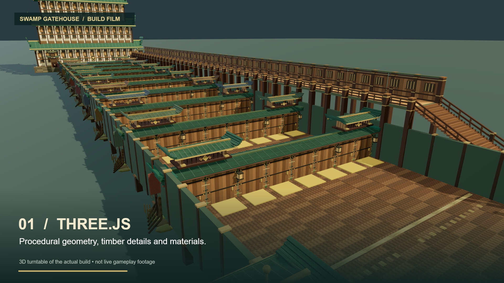

# Swamp Gatehouse

A worked example of the [MML Build Workflow agent skill](https://github.com/jaybmcv/mml-build-workflow): procedural Three.js geometry → reusable GLB assets → MML scene and shared door logic.



Ten rows, eighty doors, a raised timber host walkway, and a decorated castle wall. The reference build ledger reports **242,056 authored triangles**; this is not a whole-world performance measurement. The screenshot is a local presentation render, not native gameplay footage.

## Run locally

Requires Node.js 22+ and npm. From this repository:

```sh
npm ci
npm run build
npm run validate
npm run audit
npm run serve
```

On Windows use `npm.cmd` if PowerShell blocks npm.ps1. Open http://localhost:7079 and select **swamp-full-course-host-walk-preview.html** for the complete lit preview. The normal host-walk file uses host lighting. Do not choose intermediate build stages if you want the finished course. Use another port if 7079 is occupied.

The two final GLBs and full MML are included. `npm run build` reproduces the asset pipeline from procedural sources; it also generates the compact MML variant. The compact version creates decorative primitives at runtime and requires a script-capable authoritative MML host.

## Use with an agent

Install [the skill](https://github.com/jaybmcv/mml-build-workflow), then ask:

> Use $mml-build-workflow and this example to build a new obstacle course. Preserve the geometry/logic separation, audit repeated assets, and test one door in my target world before expanding it.

## What is where

- `scripts/build-swamp-course.mjs`: base layout and collision geometry.
- `scripts/optimize-swamp-course.mjs`: converts repeated visual detail into GLBs.
- `scripts/detail-swamp-course.mjs`: architectural decorations.
- `scripts/weather-swamp-course.mjs`: procedural wood/stone atlas and textured GLBs.
- `scripts/build-host-walkway.mjs`: raised walkway, stairs and tall castle additions.
- `scripts/swamp-course.js`: shared safe/wrong door behavior and reset handling.
- `examples/swamp-full-course-host-walk.html`: final MML scene.
- `assets/gatehouse/weathered/`: portable visual assets. Decorative GLBs do not own the gameplay colliders.

## Gameplay and world testing

Wrong doors use a moving wall plus riser: **9m push, 4m lift, 350ms out and back**, collision disabled **60ms before to 60ms after the apex**. Correct doors reclose. These are project tuning values, not a portable avatar impulse API. Historical Swamp trials informed this build; small avatars, strafing, jumping, crowds and different clients still need testing for any deployed revision. Local schema/GLB checks do not establish native-world reliability or 100-player capacity.

The reset prompt uses **demo-reset**, deliberately public. This is a demonstration gate, not authentication. Replace or remove it for your own use; do not put a real secret in public MML source.

## Bring it into your own world

Upload the two weathered GLBs to your authorized asset host. Replace the two local `/assets/gatehouse/weathered/...` paths in the final MML with the returned URLs. Verify the complete document survives editor save/reload. Test contact receipt, scene motion and avatar displacement separately. The build includes no private editor project, broadcast URL, account credentials or placement automation. World permissions and current platform support are your responsibility.

See [validation notes](docs/validation.md). This repository publishes example source, not a hosted game or a claim of affiliation with MML or Otherside.
